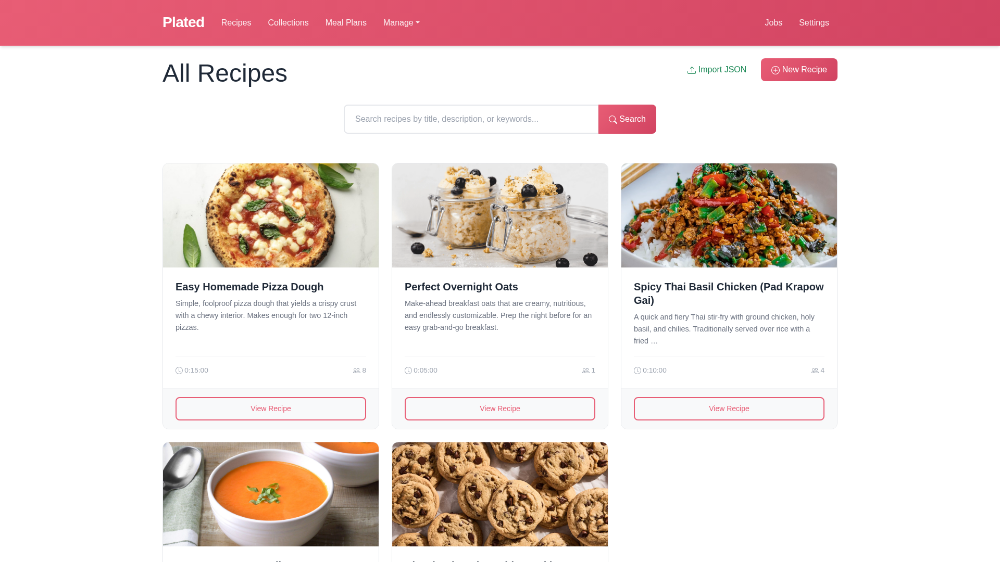
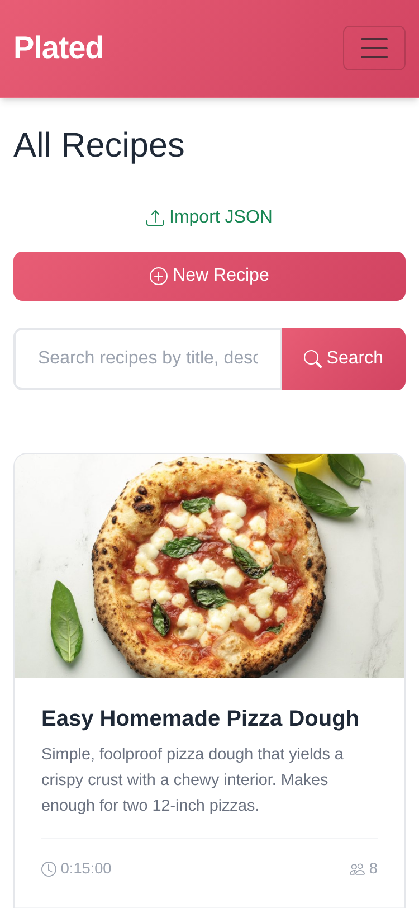

# Plated

**Modern recipe management for your kitchen.**

Plated is a Django-based web application for organizing, creating, and
managing your recipes. Built with simplicity and usability in mind.

## Screenshots

=== "Desktop"
    
    *Plated on desktop - full recipe browsing experience*

=== "Tablet"
    
    *Plated on tablet - responsive layout adapts to medium screens*

=== "Mobile"
    
    *Plated on mobile - optimized for on-the-go cooking*

## Key Features

- **Recipe Management** - Create, edit, and organize recipes with
  ingredients, steps, and images
- **Collections** - Group related recipes together
- **Smart Input** - Autocomplete for ingredient names and units to
  maintain consistency
- **Import/Export** - JSON-based recipe data exchange
- **PDF Generation** - Export recipes to beautifully formatted PDFs
  using Typst
- **Mobile-Friendly** - Responsive design works on all devices
- **Dark Mode** - Multiple color themes including dark mode
- **Internationalization** - Support for multiple languages
- **AI Extraction** - Extract recipe data from URLs using AI

## Quick Start

Choose your installation method:

- **[Native Installation](installation/native.md)** - Install directly
  on your system using Python and uv
- **[Docker Installation](installation/docker.md)** - Run in containers
  with Docker Compose

## Technology Stack

- **Backend**: Django 5.2+
- **Database**: SQLite
- **Frontend**: Bootstrap 5, vanilla JavaScript
- **PDF Generation**: Typst
- **Package Management**: uv
